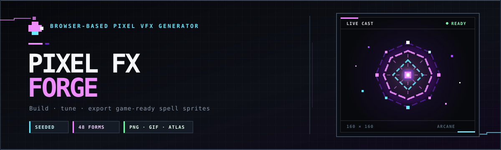
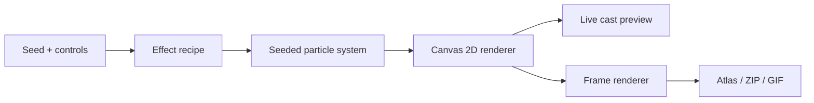

<p align="center">
  
</p>

<p align="center">
  <strong>Design, tune, preview, and export game-ready pixel spell effects directly in your browser.</strong>
</p>

<p align="center">
  <a href="https://gamingtoolset.github.io/pixel-ability-fx-forge/"><strong>Launch the forge</strong></a>
  ·
  <a href="https://gamingtoolset.github.io/pixel-ability-fx-forge/website/">Project page</a>
  ·
  <a href="#quick-start">Run locally</a>
</p>

<p align="center">
  
  
  
  
  <a href="https://github.com/GamingToolset/pixel-ability-fx-forge/stargazers"></a>
</p>

## Overview

Pixel FX Forge is a zero-build, client-side tool for creating animated pixel-art ability effects. Choose an effect family, element, formation, geometry, trace, particle kit, and timing style; iterate with a reproducible seed; then export the result for use in a game, prototype, or concept sheet.

Everything is rendered locally with the Canvas 2D API. There is no account, backend, upload step, or generated asset stored by the project.

## Highlights

- **Deterministic generation** — the same seed and options recreate the same effect.
- **48 formations** — 16 formations for each of the Impact, Barrier, and Aura families.
- **10 elemental palettes** — Fire, Frost, Nature, Earth, Storm, Arcane, Shadow, Radiance, Blood, and Tide.
- **Fine-grained direction** — combine formations, geometries, traces, particle shapes, flow, and temporal style.
- **Live pixel preview** — replay or pause a complete cast while inspecting its current stage.
- **Resolution-aware rendering** — export square frames at 128, 160, 192, or 256 pixels without smoothing.
- **Three export workflows** — download a sprite atlas, a zipped PNG sequence with recipe metadata, or a looping transparent GIF.
- **No build tooling** — plain HTML, CSS, and JavaScript modules are enough to run and deploy the app.

## Feature matrix

| Area | Available options |
| --- | --- |
| Effect families | Impact / AoE, Ward / Barrier, Aura / Restore |
| Power levels | Restrained, Standard, Mythic |
| Element palettes | 10 curated five-color palettes |
| Formations | 48 total, including radial blooms, fissures, orbitals, polygon shells, helixes, tidal bands, and mote swarms |
| Trace styles | Pixels, dashes, shards, clusters, sparks, chains, streaks, paired marks, checker patterns, spray, and beads |
| Particle control | 18 mixed particle kits plus direct shape selection |
| Timing | Instant, staggered, double-pulse, slow-build, and echo |
| Frame sizes | 128 × 128, 160 × 160, 192 × 192, 256 × 256 |
| Frame counts | 24, 32, or 48 frames |
| GIF rates | 12, 16, or 24 FPS |

## Quick start

### Requirements

- A modern desktop browser with JavaScript modules, Canvas 2D, Web Workers, and `structuredClone` support.
- Any local HTTP server. Python is used below because it is commonly available.

### Run locally

```bash
git clone https://github.com/GamingToolset/pixel-ability-fx-forge.git
cd pixel-ability-fx-forge
python -m http.server 8000
```

On Windows, `py -m http.server 8000` works if the Python launcher is installed.

Open [http://localhost:8000](http://localhost:8000) in your browser. Use an HTTP server instead of opening `index.html` directly because the application loads its renderer as a JavaScript module.

No dependency installation or build command is required.

## Using the forge

1. **Choose a variation.** Enter a seed to reproduce an effect, or use the refresh control for a new seed.
2. **Set the visual language.** Pick an archetype, power level, elemental palette, formations, geometries, trace styles, particles, flow, and timing.
3. **Inspect the cast.** Use **Cast again** and **Pause** while checking duration, particle count, layers, symmetry, and the stage timeline.
4. **Select export settings.** Choose a frame size and frame count. GIF export also uses the selected frame rate.
5. **Export the asset.** Download a sprite atlas, PNG sequence, or transparent GIF.

Changing the family, element, power level, or seed creates a fresh recipe. The remaining structure controls tune the active recipe directly.

## Export formats

| Export | Result | Best for |
| --- | --- | --- |
| Sprite atlas | One PNG arranged in up to 8 columns | Engines and tools that slice sprite sheets |
| PNG sequence | ZIP containing numbered transparent PNG frames and `recipe.json` | Editing, compositing, custom encoders, and reproducible source data |
| Transparent GIF | Looping animated GIF at the selected FPS | Documentation, previews, issue discussions, and quick sharing |

All animations are centered on a fixed internal 160 × 160 coordinate system and scaled to the selected output size with image smoothing disabled. Generated effects are kept away from the frame boundary to make atlas slicing and in-engine placement predictable.

> [!NOTE]
> GIF transparency is palette-based. Soft translucent pixels are prepared against a near-black matte before encoding, so a faint dark edge can be visible on very light backgrounds. Use the PNG sequence when you need full alpha fidelity.

## How it works



`createEffectRecipe()` turns a seed and the high-level controls into a complete recipe. `AbilityEffect` clones that recipe, builds a deterministic particle set, and draws any point in the animation timeline. The export path renders the same effect at evenly spaced timestamps, so the preview and downloaded frames use the same renderer.

## Renderer API

The core generator can also be imported from [`js/AbilityEffect.js`](./js/AbilityEffect.js) in another browser module.

```js
import {
  AbilityEffect,
  createEffectRecipe,
  renderEffectFrames
} from './js/AbilityEffect.js';

const recipe = createEffectRecipe({
  family: 'barrier',
  element: 'frost',
  power: 'mythic',
  seed: 4242
});

const canvas = document.querySelector('canvas');
const context = canvas.getContext('2d');
const effect = new AbilityEffect(recipe);

// Draw the effect 42% of the way through its cast.
effect.draw(context, effect.duration * 0.42);

// Render a complete 32-frame sequence at 256 × 256.
const { frames } = await renderEffectFrames({
  recipe,
  size: 256,
  frameCount: 32
});
```

Useful exports include:

- `createEffectRecipe(options)` — creates a normalized, deterministic recipe.
- `randomSeed()` — produces a non-zero unsigned 32-bit seed.
- `AbilityEffect` — builds and draws an effect at an arbitrary timestamp.
- `renderEffectFrame(recipe, time, size)` — returns one rendered canvas.
- `renderEffectFrames({ recipe, size, frameCount })` — asynchronously returns a full frame sequence.
- `EFFECT_FAMILIES`, `ELEMENTS`, `FORMATIONS`, `POWER_LEVELS`, `PARTICLE_KITS`, `PARTICLE_SHAPES`, `TRACE_STYLES`, and `TEMPORAL_STYLES` — metadata used by the interface.

## Project structure

```text
pixel-ability-fx-forge/
├── assets/
│   └── repo-banner.svg       # GitHub README artwork
├── css/
│   └── style.css             # Forge interface and responsive layout
├── js/
│   ├── AbilityEffect.js      # Recipe generator and Canvas 2D renderer
│   ├── main.js               # UI state, playback, and exporters
│   └── gif.worker.js         # Local gif.js encoding worker
├── tests/
│   └── effect-harness.html   # Browser-based deterministic render checks
├── website/
│   ├── index.html            # Optional project landing page
│   ├── script.js             # Animated landing-page samples
│   └── style.css             # Landing-page styles
├── index.html                # Main application
└── README.md
```

## Dependencies

The application has no package-manager dependencies and no compile step. Two browser libraries are loaded from cdnjs by `index.html`:

| Library | Version | Purpose |
| --- | --- | --- |
| [JSZip](https://stuk.github.io/jszip/) | 3.10.1 | Packages PNG frames and `recipe.json` into a ZIP archive |
| [gif.js](https://jnordberg.github.io/gif.js/) | 0.2.0 | Encodes exported frames as an animated GIF |

The live preview and sprite-atlas export are implemented with browser APIs. ZIP and GIF export require the CDN scripts to load; `js/gif.worker.js` is included locally for GIF encoding workers.

## Verification

Start the local server, then open:

```text
http://localhost:8000/tests/effect-harness.html
```

The harness prints a JSON report and sets `"passed": true` when all checks succeed. It verifies:

- deterministic output for identical recipes;
- distinct render signatures for the three effect families;
- transparent final frames and non-empty mid-cast frames;
- unique recipe DNA across 384 seeded variations;
- a fixed center pivot and edge-safe rendering;
- all 48 formation representatives across multiple animation phases;
- requested frame counts and exported canvas dimensions.

Because these tests use Canvas APIs, they run in a browser rather than a Node.js test runner.

## Deploying to GitHub Pages

The repository is already structured as a static site:

1. Push the project to GitHub.
2. Open **Settings → Pages** in the repository.
3. Under **Build and deployment**, select **Deploy from a branch**.
4. Choose the target branch and the repository root (`/`).
5. Save and wait for the Pages deployment to finish.

The root URL serves the forge. The optional promotional landing page remains available at `/website/`.

## Browser notes

- The forge is designed for desktop viewports; its main workspace has a minimum width of 780 pixels.
- Pixel edges rely on Canvas 2D rendering with `imageSmoothingEnabled = false`.
- Reduced-motion preferences are respected by the animated project landing page.
- If an exporter reports that it is still loading, check that cdnjs is reachable and reload the page.

## Contributing

Contributions are welcome. A focused workflow is:

1. Fork the repository and create a feature branch.
2. Make a small, clearly scoped change.
3. Run the browser verification harness.
4. Check the main UI at multiple desktop sizes.
5. Open a pull request describing the visual or rendering impact and the seeds used for verification.

When changing generation logic, keep seeded output deterministic, maintain the fixed `(80, 80)` pivot, and ensure no visible pixels touch the export boundary.

## License

This project is distributed under the **Apache-2.0 license**.

See [`LICENSE`](./LICENSE) for full legal text.

## ❤️ Support the Project

If you find this tool useful, consider leaving a ⭐ on GitHub

---

<p align="center">
  Built for game developers, technical artists, and anyone who likes their magic crisp at 1×.
</p>
